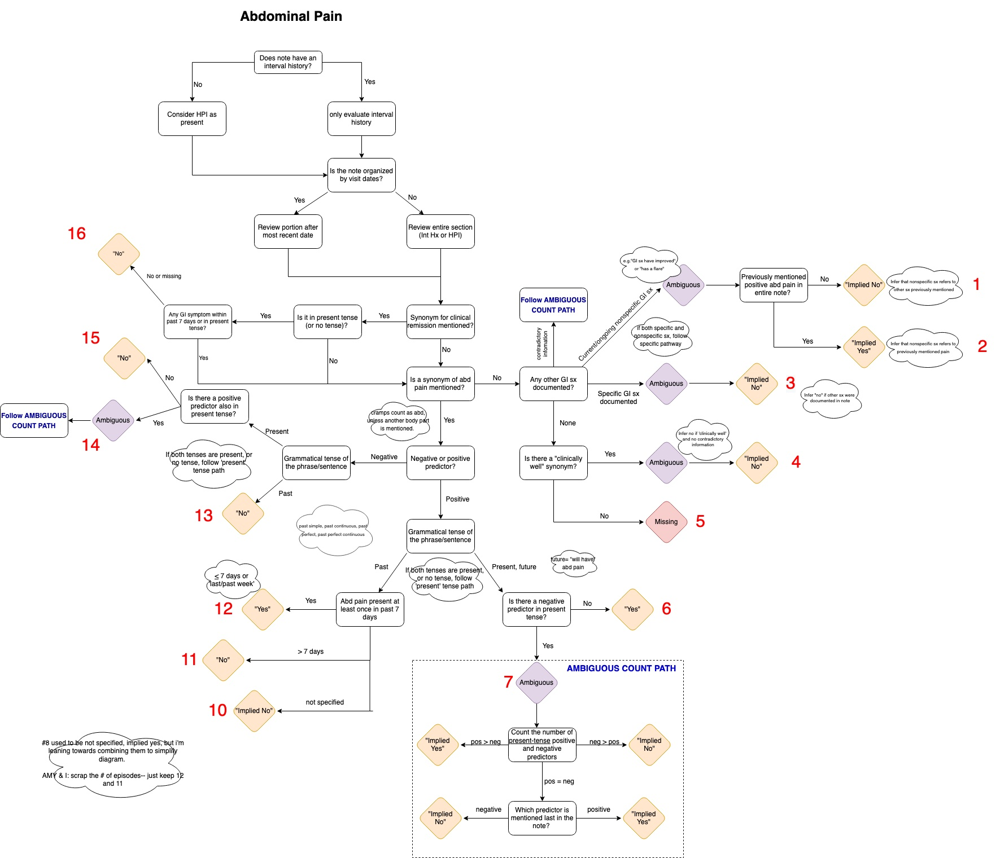

## UCSF Medical Note Pipeline for Identifying Inflammatory Bowel Disease

In this project, our goal is to establish a rules-based approach for identifying important features present in select UCSF medical notes pertaining to Inflammatory Bowel Disease (IBD), with the aim of labeling each note with three specific symptoms related to IBD: abdominal pain, diarrhea, and blood in stool (also referred to as fecal blood).

## Table of Contents

- [Description](#description)
- [Getting Started](#getting-started)
  - [Prerequisites](#prerequisites)
  - [Installation](#installation)
- [Usage](#usage)
- [Diagrams](#diagrams)
- [Contributing](#contributing)
- [License](#license)

## Description

In the medical field, we have taken note of two points: 1) we have seen that the simple diagnosis of patients via noted symptoms can sometimes be difficult, but even more so if the decision is made by notes from a patient visit, rather than the visit itself, and 2) while most attention related to the notes of doctors pertains to their handwriting, our research humbly suggests that even after their scrawl is deciphered, their grammar is equally as cryptic. Thus, the goal of this pipeline attempts to address these two points by A) constructing a pipeline that can parse these notes according to the factors identified by our resident gastroenterologists and form them into a tabular format, and B) using these newly constructed features to create models for attaching labels to these notes regarding the three main symptoms mentioned earlier: abdominal pain, diarrhea, and fecal blood.

## Getting Started

### Prerequisites

### Installation

## Usage

